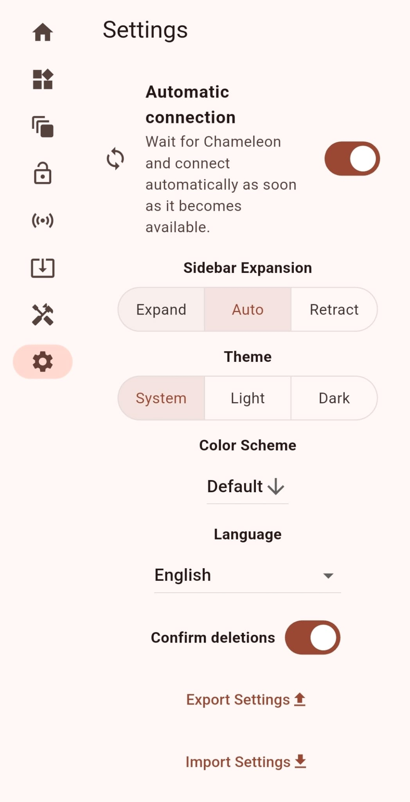
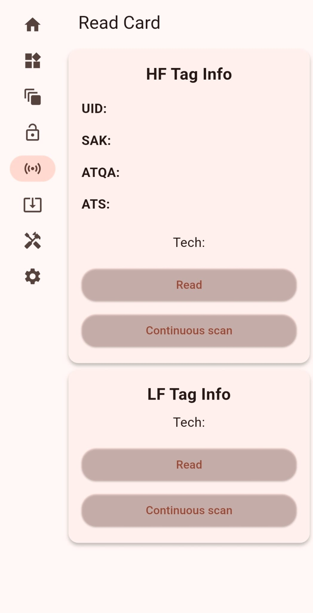
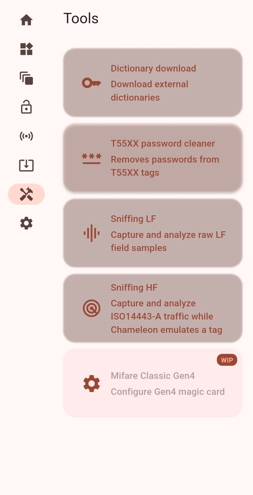
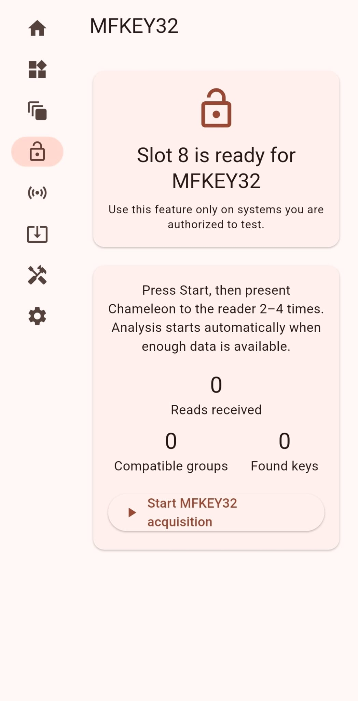

# Chameleon Ultra GUI – Pierluigi Fork

Interfaccia Flutter multipiattaforma per Chameleon Ultra e Chameleon Lite.

[](https://github.com/Lucarini63/ChameleonUltraGUI-Pierluigi/releases/latest)

> **Fork non ufficiale.** Questo repository deriva da
> [GameTec-live/ChameleonUltraGUI](https://github.com/GameTec-live/ChameleonUltraGUI)
> e contiene modifiche sviluppate per il fork di Pierluigi. Il progetto originale,
> i relativi autori e tutti i contributori upstream mantengono i rispettivi crediti.

## Funzioni principali

- gestione connessione, slot, carte salvate e Dump Editor;
- lettura MIFARE Classic con dizionari selezionabili, avanzamento, annullamento e pianificazione automatica del recupero;
- scrittura MIFARE Classic con scelta tra mantenere l’UID originale oppure generarne uno nuovo, quando il tipo di carta lo consente;
- lettura sicura NTAG/Ultralight con analisi `AUTH0`, `PROT` e `AUTHLIM`;
- riconoscimento MIFARE DESFire e informazioni ISO/IEC 14443-4;
- MFKey32 e recupero delle chiavi da acquisizioni autorizzate;
- Sniffing HF con frame, nonce, recupero e dati grezzi;
- Sniffing LF con sommario, forma d’onda, transizioni e dati esadecimali;
- analisi intuitiva delle credenziali HID Prox/Indala con Facility Code e numero credenziale;
- attesa e riconnessione automatica opzionale del Chameleon.

Alcune funzioni dipendono dalle capacità esposte dal firmware installato sul dispositivo.

## Novità del fork

- pianificatore automatico che sceglie il percorso di recupero MIFARE Classic più adatto;
- dizionari ordinati dal più piccolo al più grande, con selezione iniziale del più piccolo;
- arresto al termine del dizionario selezionato, annullamento e indicatore di avanzamento;
- avvio automatico del recupero quando il dizionario non trova le chiavi necessarie;
- controllo adattivo delle chiavi mancanti e messaggi distinti per Darkside e Nested;
- riconoscimento MIFARE DESFire/ISO-DEP senza interferire con i flussi Classic e Ultralight;
- audit NTAG/Ultralight, esportazione dei dati letti e dizionario dedicato `ntag_audit.dic`;
- acquisizione e analisi Sniffing LF/HF, con riepiloghi, frame, nonce e dati grezzi;
- connessione automatica opzionale in attesa della disponibilità del Chameleon;
- scelta, durante la scrittura compatibile, tra UID originale e nuovo UID casuale.

## Schermate

| Funzione | Anteprima |
| --- | --- |
| **Connessione automatica** — resta in attesa del Chameleon e si collega quando diventa disponibile. |  |
| **Lettura HF e LF** — riconoscimento guidato della tecnologia e scelta automatica del percorso di lettura appropriato. |  |
| **Strumenti LF/HF** — dizionari, pulizia T55XX e analisi delle acquisizioni Sniffing. |  |
| **MFKEY32** — acquisizione assistita, conteggio letture, gruppi compatibili e chiavi recuperate. |  |

Le schermate non contengono UID di carte, chiavi o identificativi Bluetooth reali.

## Installazione Android

L’APK pronto per i test è disponibile nella pagina
[GitHub Releases](https://github.com/Lucarini63/ChameleonUltraGUI-Pierluigi/releases/latest).
Scaricare `ChameleonUltraGUI.apk` e consentire temporaneamente l’installazione da
fonti esterne sul dispositivo Android. La build pubblicata è una versione di prova:
verificare sempre l’hash SHA-256 indicato nelle note della release.

## Requisiti di sviluppo

- Flutter SDK compatibile con Dart 3;
- JDK 17 o successivo;
- Android SDK 36 e NDK `28.2.13676358` per la build Android;
- Chameleon Ultra o Chameleon Lite per le funzioni hardware.

## Preparazione e verifica

```shell
flutter pub get
flutter analyze
flutter test
```

Esecuzione in sviluppo:

```shell
flutter run
```

Build APK:

```shell
flutter build apk --release
```

Senza `android/key.properties` e un keystore privato, la configurazione corrente
produce un APK di prova firmato con la chiave debug. Keystore, password, file
`local.properties`, APK e directory di build sono esclusi da Git.

## Struttura del progetto

- `lib/gui/`: pagine, componenti e finestre dell’interfaccia;
- `lib/helpers/`: protocolli, analisi dump, recupero e scrittura;
- `lib/bridge/` e `lib/connector/`: comunicazione con il dispositivo;
- `lib/l10n/`: sorgenti delle traduzioni;
- `test/`: test del recupero, sniffing, DESFire, NTAG e analisi LF;
- `third_party/usb_serial/`: copia locale compatibile con Gradle 9, con licenza propria inclusa;
- cartelle di piattaforma: `android/`, `ios/`, `windows/`, `linux/`, `macos/` e `web/`.

## Uso responsabile

Utilizzare lettura, sniffing, recupero chiavi, emulazione e scrittura esclusivamente
su dispositivi, carte e impianti propri o per i quali si dispone di autorizzazione
esplicita. Il software non attribuisce identità o permessi partendo dal solo codice
di una credenziale.

## Crediti e progetto originale

- progetto upstream: [GameTec-live/ChameleonUltraGUI](https://github.com/GameTec-live/ChameleonUltraGUI);
- autori e contributori originali: [pagina Contributors upstream](https://github.com/GameTec-live/ChameleonUltraGUI/graphs/contributors);
- icone originali dell’app: [St.Ricky](https://github.com/Saint-Ricky), come indicato dal README upstream;
- fork modificato: [Lucarini63/ChameleonUltraGUI-Pierluigi](https://github.com/Lucarini63/ChameleonUltraGUI-Pierluigi).

## Licenza

Il progetto resta distribuito secondo la **GNU General Public License v3.0**.
Il testo originale e non modificato è disponibile in [LICENSE](LICENSE). I componenti
di terze parti conservano le rispettive licenze.
